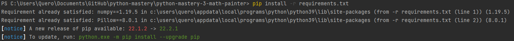

# python-mastery-3-math-painter

## Title: Math Painter
## Description:
An app that lets the user provide the start coordinates of geometrical shapes such as
squares and rectangles, their dimensions, and their colors, and the program produces an image file canvas with all
the geometrical shapes drawn in it.

## Objects:
Square:
- x
- y
- side
- color
- draw(canvas)

Rectangle:
- x
- y
- width
- height
- color
- draw(canvas)

Canvas:
- width
- height
- color
- make(imagepath)

## Install requirements:
```
numpy==1.19.5
Pillow==8.0.1
```

How to install requirements:
```
pip install -r requirements.txt
```



# Input:
# Output:
Terminal:


Author: [Christian Antony Quero](https://www.linkedin.com/in/christianquero/)